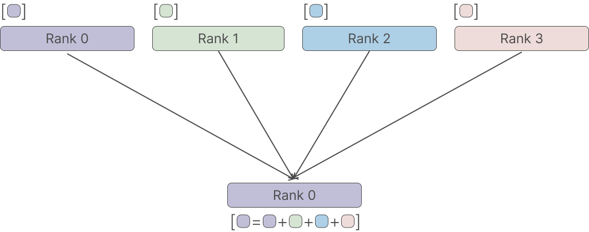
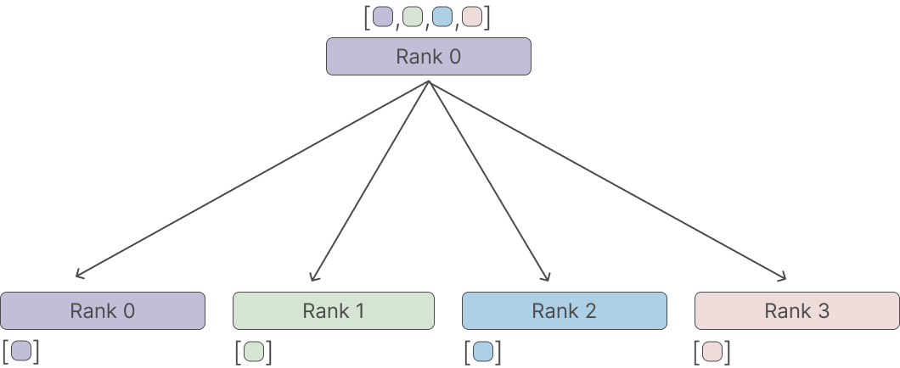
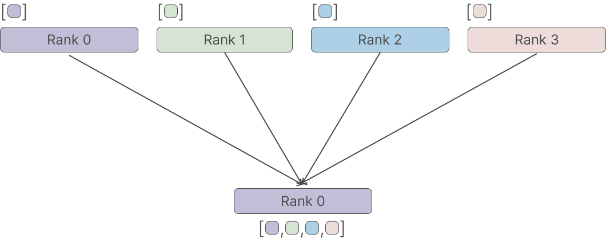
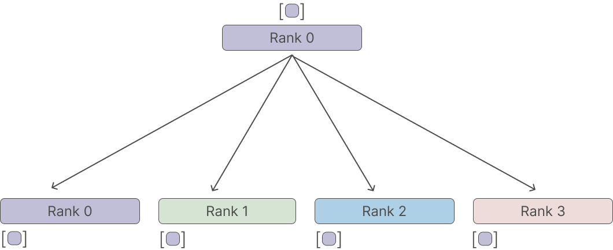

# Collective Communication in Distributed Systems with PyTorch


Today, we will explore the use of [PyTorch]](https://pytorch.org/get-started/locally/)'s distributed collective communication feature. When working with multiple GPUs, it is necessary to share tensors across them, which is where [`torch.distributed`](https://pytorch.org/tutorials/intermediate/dist_tuto.html) comes in. It provides a set of APIs to send and receive tensors among multiple workers. Typically, a worker is a process responsible for a specific GPU. When training neural networks on multiple GPUs, it is often necessary to collect tensors across multiple GPUs/processors. A common example is when computing gradients across multiple GPUs to perform an optimizer step. In this case, we must first send all gradients to all GPUs, average them, and then perform a local optimizer step. This is precisely what the `all reduce `function does, but more on that later. We will provide figures and code examples for each of the six collection strategies in `torch.dist`: `reduce`, `all reduce`, `scatter`, `gather`, `all gather` and `broadcast`.

## Setup

We tested the code with `python=3.9` and `torch=1.13.1`. 

Before we see each collection strategy, we need to setup our multi processes code. Copied from [PyTorch doc](https://pytorch.org/tutorials/intermediate/dist_tuto.html), we have to first write a function to initialise the process that will run this file.


```python
import os
from typing import Callable

import torch
import torch.distributed as dist

def init_process(rank: int, size: int, fn: Callable[[int, int], None], backend="gloo"):
    """Initialize the distributed environment."""
    os.environ["MASTER_ADDR"] = "127.0.0.1"
    os.environ["MASTER_PORT"] = "29500"
    dist.init_process_group(backend, rank=rank, world_size=size)
    fn(rank, size)
```

the call to `dist.init_process_group` is where the magic happens. 

Then, we can use `torch.multiprocessing` to spawn the process, in our case `4`.

```python
...
import torch.multiprocessing as mp


def func(rank: int, size: int):
    # each process will call this function
    continue

if __name__ == "__main__":
    size = 4
    processes = []
    mp.set_start_method("spawn")
    for rank in range(size):
        p = mp.Process(target=init_process, args=(rank, size, func))
        p.start()
        processes.append(p)

    for p in processes:
        p.join()

```

The code creates and runs a number of separate processes, using the `torch.multiprocessing` module. `mp.set_start_method("spawn")` is used to set the start method of the processes to spawn, which allows new processes to be created. Each spawned `mp.Process` calls `init_process` and then a user specified function `func` with `rank` and `size` as parameter.

Let's create a simple example,

```python
...
def hello_world(rank: int, size: int):
    print(f"[{rank}] say hi!")

...
for rank in range(size):
    # passing `hello_world`
    p = mp.Process(target=init_process, args=(rank, size, hello_world)) 
...
```

Will output

```
[0] say hi!
[2] say hi!
[3] say hi!
[1] say hi!
```

## Reduce

The reduce operation in torch.distributed is used to combine tensors from multiple GPUs or processes into a single tensor on one of the GPUs or processes. The reduce operation applies a specified reduction operation (e.g. sum, product, max) element-wise to the input tensors and returns the result on a single GPU or process, known as the root rank. The root rank is specified as an argument when calling the reduce function.



In the figure, we have `4` process and we reduce all the tensors to `rank0`.  Each process has a tensor with one.

```python
def do_reduce(rank: int, size: int):
    # create a group with all processors
    group = dist.new_group(list(range(size)))
    tensor = torch.ones(1)
    # sending all tensors to rank 0 and sum them
    dist.reduce(tensor, dst=0, op=dist.ReduceOp.SUM, group=group)
    # can be dist.ReduceOp.PRODUCT, dist.ReduceOp.MAX, dist.ReduceOp.MIN
    # only rank 0 will have four
    print(f"[{rank}] data = {tensor[0]}")
```

outputs:

```
[1] data = 3.0
[2] data = 2.0
[0] data = 4.0
[3] data = 1.0
```

Only `rank0` has the reduced value (`4`).

The `op` to `dist.reduce` argument specifies the reduction operation, which in this case is set to`torch.distributed.ReduceOp.SUM`, other possibilities are `PRODUCT` , `MAX` and `MIN`.

It's important to notice that the reduce operation is done between the tensors on different devices, the root rank need to have a copy of the tensor on the local memory to perform the operation on it, in our case `tensor`.

## All Reduce
The all_reduce operation in torch.distributed is similar to the reduce operation, but instead of returning the result on a single GPU or process, it returns the result on all GPUs or processes.

Like the reduce operation, all_reduce applies a specified reduction operation (e.g. sum, product, max) element-wise to the input tensors and returns the result on all GPUs or processes. This allows for easy computation of values such as the mean or sum of a tensor across all GPUs or process


The code,

```python
def do_all_reduce(rank: int, size: int):
    # create a group with all processors
    group = dist.new_group(list(range(size)))
    tensor = torch.ones(1)
    dist.all_reduce(tensor, op=dist.ReduceOp.SUM, group=group)
    # can be dist.ReduceOp.PRODUCT, dist.ReduceOp.MAX, dist.ReduceOp.MIN
    # will output 4 for all ranks
    print(f"[{rank}] data = {tensor[0]}")
```

outputs:

```
[3] data = 4.0
[0] data = 4.0
[1] data = 4.0
[2] data = 4.0
```

Each process has the reduced value (`4`).

## Scatter


```python
def do_scatter(rank: int, size: int):
    # create a group with all processors
    group = dist.new_group(list(range(size)))
    tensor = torch.empty(1)
    # sending all tensors from rank 0 to the others
    if rank == 0:
        tensor_list = [torch.tensor([i + 1], dtype=torch.float32) for i in range(size)]
        # tensor_list = [tensor(1), tensor(2), tensor(3), tensor(4)]
        dist.scatter(tensor, scatter_list=tensor_list, src=0, group=group)
    else:
        dist.scatter(tensor, scatter_list=[], src=0, group=group)
    # each rank will have a tensor with their rank number
    print(f"[{rank}] data = {tensor[0]}")
```

## Gather
The `gather` operation in `torch.distributed` is used to collect tensors from multiple GPUs or processes and concatenate them into a single tensor on one of the GPUs or processes, known as the root rank. The root rank is specified as an argument when calling the gather function.



The code,

```python
def do_gather(rank: int, size: int):
    # create a group with all processors
    group = dist.new_group(list(range(size)))
    tensor = torch.tensor([rank], dtype=torch.float32)
    # sending all tensors from rank 0 to the others
    if rank == 0:
        # create an empty list we will use to hold the gathered values
        tensor_list = [torch.empty(1) for i in range(size)]
        dist.gather(tensor, gather_list=tensor_list, dst=0, group=group)
    else:
        dist.gather(tensor, gather_list=[], dst=0, group=group)
    # only rank 0 will have the tensors from the other processed
    # [tensor([0.]), tensor([1.]), tensor([2.]), tensor([3.])]
    if rank == 0:
        print(f"[{rank}] data = {tensor_list}")
```

outputs:

```
[0] data = [tensor([0.]), tensor([1.]), tensor([2.]), tensor([3.])]
```

`rank0` has the gathered tensors.

Also, the `gather` operation requires that the shape of the tensors on all the devices are the same and the root rank need to have a copy of the tensor on the local memory to perform the operation on it.

It's useful when you want to have all the information on one device or process to perform some kind of operation or analysis on it.

## All Gather
The all_gather operation in torch.distributed is similar to the gather operation, but instead of returning the concatenated tensor on a single GPU or process, it returns the concatenated tensor on all GPUs or processes.

Like the gather operation, `all_gather` collects tensors from multiple GPUs or processes and concatenate them into a single tensor on all GPUs or processes. This allows for easy collection of information from all GPUs or processes.


The code,

```python
def do_all_gather(rank: int, size: int):
    # create a group with all processors
    group = dist.new_group(list(range(size)))
    tensor = torch.tensor([rank], dtype=torch.float32)
    # create an empty list we will use to hold the gathered values
    tensor_list = [torch.empty(1) for i in range(size)]
    # sending all tensors to the others
    dist.all_gather(tensor_list, tensor, group=group)
    # all ranks will have [tensor([0.]), tensor([1.]), tensor([2.]), tensor([3.])]
    print(f"[{rank}] data = {tensor_list}")
```

outputs,

```
[0] data = [tensor([0.]), tensor([1.]), tensor([2.]), tensor([3.])]
[2] data = [tensor([0.]), tensor([1.]), tensor([2.]), tensor([3.])]
[3] data = [tensor([0.]), tensor([1.]), tensor([2.]), tensor([3.])]
[1] data = [tensor([0.]), tensor([1.]), tensor([2.]), tensor([3.])]
```

Each process has the gathered data. The `all_gather` operation requires that the shape of the tensors on all the devices are the same.

It's useful when you want to have a copy of the information on all the devices or processes, maybe to synchronize something.

## Broadcast
The `broadcast` operation in torch.distributed is used to send a tensor from one GPU or process, known as the root rank, to all other GPUs or processes. The root rank is specified as an argument when calling the broadcast function.



The code,

```python
def do_broadcast(rank: int, size: int):
    # create a group with all processors
    group = dist.new_group(list(range(size)))
    if rank == 0:
        tensor = torch.tensor([rank], dtype=torch.float32)
    else:
        tensor = torch.empty(1)
        # sending all tensors to the others
    dist.broadcast(tensor, src=0, group=group)
    # all ranks will have tensor([0.]) from rank 0
    print(f"[{rank}] data = {tensor}")
```

outputs,

```
[2] data = tensor([0.])
[1] data = tensor([0.])
[3] data = tensor([0.])
[0] data = tensor([0.])
```

Each process has the `rank0` tensor. The `broadcast` function is useful when you want to share the same information or values across multiple GPUs or processes. For example, you can use it to share the model's parameters or shared optimizer states across multiple GPUs or processes.

## Conclusion

In conclusion, PyTorch's distributed collective communication feature provides a powerful set of tools for working with multiple GPUs. The six collection strategies we have discussed - `reduce`, `all reduce`, `scatter`, `gather`, `all gather` and `broadcast` - offer a range of options for sharing tensors across workers. Each strategy has its own use case and can be tailored to the specific needs of your project. By mastering these strategies, you can effectively train neural networks on multiple GPUs, improving performance and scalability. With this knowledge, you can take full advantage of the power of distributed computing and unlock the full potential of your models.

Thanks for reading :)